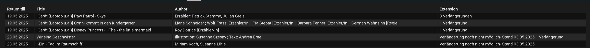

# home-assistant-voebb
Display lent media from VOEBB (Verbund der Öffentlichen Bibliotheken Berlins) in Home-Assistant.

# How to use

- Run a [standalone-chromium](https://github.com/mrueg/addon-standalone-chromium) or similar to allow the integration to connect to the Selenium Webdriver.
- If you run this addon, copy the container name when it is started and enter its container name in the config flow.
- Add your username and password from the library.


# Display

You can visualize the media you borrowed using the [flex-table-card](https://github.com/custom-cards/flex-table-card) lovelace card.

```
type: custom:flex-table-card
entities:
  include: sensor.voebb.*
columns:
  - name: Return date
    data: items.return_date
  - name: Title
    data: items.title
  - name: Author
    data: items.author
  - name: Location
    data: items.library
  - name: Extension
    data: items.extension
```

and this is how it will look like:


