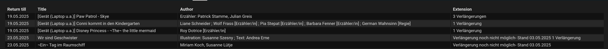

# home-assistant-voebb

[](https://github.com/mrueg/home-assistant-voebb/actions/workflows/ci.yml)

Display lent media from VOEBB (Verbund der Öffentlichen Bibliotheken Berlins) in Home Assistant.

The integration logs into your library account on [voebb.de](https://www.voebb.de) and shows what you
borrowed and when it is due. It talks to the website directly over HTTP, no browser or Selenium is needed.

## Installation

Requires Home Assistant 2025.3 or newer.

### HACS

1. In HACS, open the menu in the top right corner and select **Custom repositories**.
2. Add `https://github.com/mrueg/home-assistant-voebb` with the type **Integration**.
3. Search for **VOEBB**, download it and restart Home Assistant.

### Manual

Copy `custom_components/voebb` into the `custom_components` folder of your Home Assistant
configuration and restart Home Assistant.

### Upgrading from 0.1 (Selenium)

Version 0.2 no longer needs a browser. When you update:

- Your existing entry keeps working, the Selenium host and port are no longer used.
- Your existing sensor is replaced by `sensor.voebb_borrowed_items`, whose state is the **number** of
  borrowed items instead of "Next item to return: …". The old sensor stays unavailable and can be
  deleted. Update automations and cards that use it, the next return date is now
  `sensor.voebb_next_return_date`.
- `return_date` in the `items` attribute is now `2026-10-12` instead of `12.10.2026`.
- The [standalone-chromium](https://github.com/mrueg/addon-standalone-chromium) add-on can be removed.

## Configuration

Go to **Settings → Devices & services → Add integration** and search for **VOEBB**.

| Field    | Description                                    |
| -------- | ---------------------------------------------- |
| Username | The number on your library card.               |
| Password | The password you use to log in at voebb.de.    |

The login is checked before the integration is added. Each library card can be added once, add the
integration again for more cards.

If your password changes, Home Assistant asks you for the new one. You can also change it with
**Reconfigure** on the integration.

## Entities

The integration refreshes every 6 hours and creates:

| Entity                          | State                                  | Attributes                  |
| ------------------------------- | -------------------------------------- | --------------------------- |
| `sensor.voebb_borrowed_items`   | Number of borrowed items               | `items`: all borrowed items |
| `sensor.voebb_next_return_date` | Date the next item is due              | `titles`: items due then    |
| `binary_sensor.voebb_overdue`   | On when an item is past its due date   | `titles`: overdue items     |
| `calendar.voebb_return_dates`   | An all-day event for every return date |                             |
| `sensor.voebb_ready_for_pickup` | Number of reserved items ready for pickup | `pickup_code`: your pickup code |
| `sensor.voebb_reservations`   | Number of reservations ("Vormerkungen") |                           |
| `sensor.voebb_orders_from_the_stacks` | Number of orders from the closed stacks ("Bestellungen (Magazin)") | |
| `sensor.voebb_library_card_valid_until` | Date your library card expires   |                             |

Each item in `items` has:

| Attribute     | Description                                                         |
| ------------- | ------------------------------------------------------------------- |
| `title`       | Title of the item                                                   |
| `author`      | Author, illustrator etc. as shown by VOEBB                          |
| `library`     | Library the item was borrowed from                                  |
| `call_number` | Shelf mark, e.g. `4.3/Tech 1128 WOHI`                               |
| `barcode`     | Barcode of the item                                                 |
| `return_date` | Date the item is due, e.g. `2026-10-12`                             |
| `renewals`    | How often the item was renewed                                      |
| `renewal_blocked` | `true` when VOEBB says a renewal isn't possible (yet), e.g. renewed today. `false` doesn't guarantee a renewal is possible, `voebb.renew` with `check_only` tells |
| `extension`   | The renewal information as shown by VOEBB                           |

If Home Assistant is set to German, the entities get German names and IDs, e.g. `sensor.voebb_ausleihen`.

## Actions

### `voebb.renew`

Renews borrowed items, like "Markierte Medien verlängern" on voebb.de.

| Field             | Description                                                                     |
| ----------------- | ------------------------------------------------------------------------------- |
| `config_entry_id` | The library card, required.                                                     |
| `barcodes`        | Barcodes of the items to renew, see the `items` attribute. Empty renews all.    |
| `check_only`      | Only ask VOEBB whether the items can be renewed, like "Markierte Medien verlängerbar?". |

It returns for each item whether it was renewed (or can be renewed with `check_only`), the return date
and the note of VOEBB, e.g.:

```yaml
items:
  - barcode: "00000000013"
    title: Der lange Wintertag
    return_date: "2026-10-23"
    success: false
    message: "nicht verlängerbar : Verlängerung noch nicht möglich- Stand 25.09.2026\n1 Verlängerung"
```

After renewing, the entities show the new return dates right away.

## Examples

### Show the borrowed items

Use the [flex-table-card](https://github.com/custom-cards/flex-table-card):

```yaml
type: custom:flex-table-card
entities:
  include: sensor.voebb*_borrowed_items
columns:
  - name: Return till
    data: items.return_date
    modify: x.split("-").reverse().join(".")
  - name: Title
    data: items.title
  - name: Author
    data: items.author
  - name: Location
    data: items.library
  - name: Extension
    data: items.extension
```

and this is how it will look like:



### Get notified 3 days before something is due

```yaml
triggers:
  - trigger: calendar
    event: start
    entity_id: calendar.voebb_return_dates
    offset: "-72:00:00"
actions:
  - action: notify.notify
    data:
      message: "{{ trigger.calendar_event.summary }} at {{ trigger.calendar_event.location }}"
```

### Renew items 2 days before they are due

```yaml
triggers:
  - trigger: calendar
    event: start
    entity_id: calendar.voebb_return_dates
    offset: "-48:00:00"
actions:
  - action: voebb.renew
    data:
      config_entry_id: <your config entry>
      # Renewable items due on the day of the event
      barcodes: >-
        
        
          
        
        {{ ns.barcodes }}
    response_variable: renewal
  - action: notify.notify
    data:
      message: >-
        {{ item.title }}: {{ 'renewed until ' ~ item.return_date if item.success else item.message }}
        
```

### Get notified when reserved items are ready for pickup

```yaml
triggers:
  - trigger: state
    entity_id: sensor.voebb_ready_for_pickup
actions:
  - condition: template
    value_template: "{{ trigger.to_state.state | int(0) > trigger.from_state.state | int(0) }}"
  - action: notify.notify
    data:
      message: >-
        {{ trigger.to_state.state }} items are ready for pickup,
        your pickup code is {{ state_attr('sensor.voebb_ready_for_pickup', 'pickup_code') }}
```

### Get reminded before your library card expires

```yaml
triggers:
  - trigger: template
    value_template: >-
      
      {{ valid_until is not none and valid_until | as_local < now() + timedelta(days=30) }}
actions:
  - action: notify.notify
    data:
      message: >-
        Your library card expires on
        {{ (states('sensor.voebb_library_card_valid_until') | as_datetime).strftime('%d.%m.%Y') }}
```

### Get notified when something is overdue

```yaml
triggers:
  - trigger: state
    entity_id: binary_sensor.voebb_overdue
    to: "on"
actions:
  - action: notify.notify
    data:
      message: "Overdue: {{ state_attr('binary_sensor.voebb_overdue', 'titles') | join(', ') }}"
```

## Known limitations

- The integration reads the VOEBB website, which has no official API. Changes to the website can break it.
- Data is only refreshed every 6 hours to not put load on the website. A manual refresh, e.g. with
  `homeassistant.update_entity`, logs in again.
- Fees and the list of reservations are not supported.
- The numbers of items ready for pickup, reservations and orders have only been tested with none, the
  text VOEBB shows otherwise (e.g. "2 Bereitstellungen") is assumed.
- Whether a renewal worked is detected by the new return date. The page VOEBB shows after a successful
  renewal hasn't been tested with real data yet.

## Troubleshooting

- **Entities are unavailable**: the website couldn't be reached or looked different than expected. The
  error is shown on the integration and in the log, the next attempt happens with the next refresh.
- **Invalid authentication**: check that you can log in on [voebb.de](https://www.voebb.de) with the same
  card number and password. Several failed logins in a row may lock your account.
- **Items are missing or wrong**: download the diagnostics from the integration's menu and attach them to
  an [issue](https://github.com/mrueg/home-assistant-voebb/issues). Password and card number are removed,
  the titles of your borrowed items are included.

For more details, enable debug logging on the integration, or in `configuration.yaml`:

```yaml
logger:
  logs:
    custom_components.voebb: debug
```

## Removal

1. Go to **Settings → Devices & services**, select **VOEBB** and delete each entry.
2. Remove the integration in HACS, or delete `custom_components/voebb` if you installed it manually.
3. Restart Home Assistant.

## Development

```sh
pip install -r requirements_test.txt
pytest
ruff check . && ruff format --check .
mypy
```
